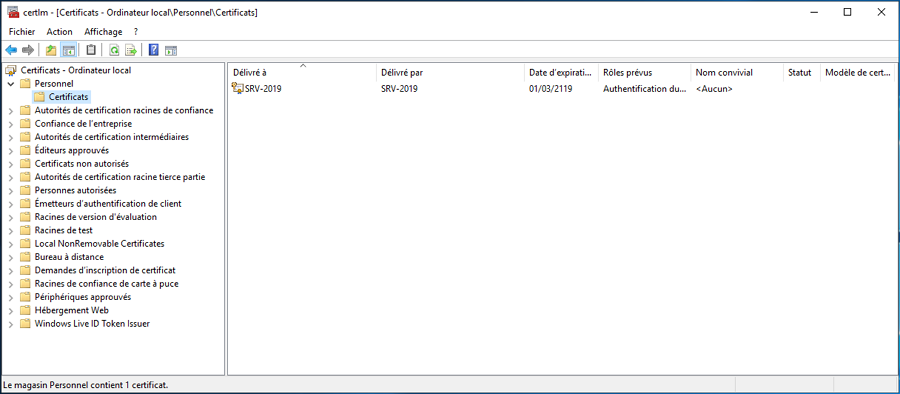

# Création d'un certificat SSL auto-signé

## 0. Utilisation

Ce script powershell génère un certificat SSL auto-signé.  
Il vous faut pour le certificat SSL auto-signé les informations suivantes :
- Un nom
- Un mot de passe

## 1. Gestionnaire des certificats
Vous pouvez visualiser vos certificats personnels ajoutés avec ***certlm.msc*** dans *Personnel > Certificats*




## 2. Problèmes et solutions

- Utilisation des scripts désactivées

    Si l'utilisation de script est désactivée pour votre système, vous pouvez le réactiver avec :
    ```powershell
    Set-ExecutionPolicy Unrestricted
    ```

- Application d'une date d'expiration

    Par défaut, le script génère un certificat SSL d'une durée de 100 ans.
    Vous pouvez appliquer une date d'expiration en modifiant ***.AddYears(100)*** par ***.AddYears(2)*** dans la ligne suivante :
    ```powershell
    #Pour une durée de 2 ans on modifie ".AddYears(100)" par ".AddYears(2)"
    New-SelfSignedCertificate -CertStoreLocation cert:\LocalMachine\my -dnsname $instance -NotAfter (Get-Date).AddYears(2)
    ```